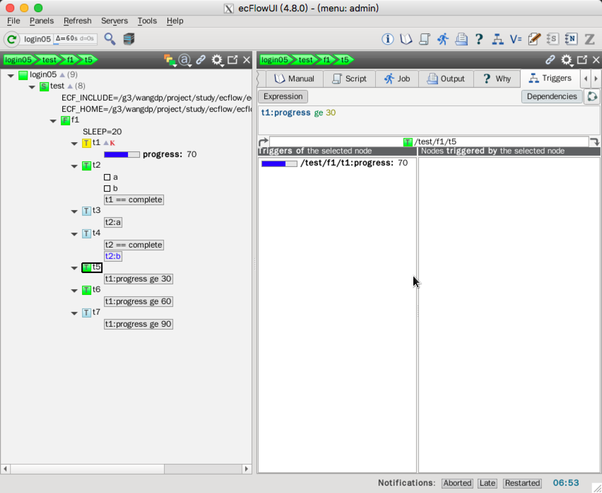

[meter](https://software.ecmwf.int/wiki/display/ECFLOW/Glossary#term-meter) 类似 [event](https://software.ecmwf.int/wiki/display/ECFLOW/Glossary#term-event)，
但不同于值为 bool 类型（on/off）的 event，meter 的值可以取一个范围内的整数。
其他任务会在 meter 达到某个特定值时被触发。类似 event，meter 有名字，一个 [task](https://software.ecmwf.int/wiki/display/ECFLOW/Glossary#term-task) 可以包含多个 meter。

## Ecf脚本

创建新的 task（t5，t6,和t7），当 task t1 的 meter 达到特定值时被触发。
为了通知 [ecflow_server](https://software.ecmwf.int/wiki/display/ECFLOW/Glossary#term-ecflow-server)，
task 必须调用 `ecflow_client --meter` 命令。

### t1.ecf

```bash
%include <head.h>
echo "I will now sleep for %SLEEP% seconds"
sleep %SLEEP%
n=1
while [[ $n -le 100 ]]               # Loop 100 times
do
   sleep 1                           # Wait a short time
   ecflow_client --meter=progress $n # Notify ecFlow
   (( n = $n + 1 ))
done
%include <tail.h>
```

## Suite definition

在 suite definition 中添加 meter。

### Text

```bash
# Definition of the suite test.
suite test
 edit ECF_INCLUDE "$ECF_HOME"    # replace '$ECF_HOME' with the path to your ECF_HOME directory
 edit ECF_HOME    "$ECF_HOME"
 family f1
     edit SLEEP 20
     task t1
         meter progress 1 100 90
     task t2
         trigger t1 eq complete
         event a
         event b
     task t3
         trigger t2:a
     task t4
         trigger t2 eq complete
         complete t2:b
     task t5
         trigger t1:progress ge 30
     task t6
         trigger t1:progress ge 60
     task t7
         trigger t1:progress ge 90
 endfamily
endsuite
```

### Python

```py
import os
from pathlib import Path
from ecflow import Defs, Suite, Task, Family, Edit, Trigger, Event, Complete, Meter


def create_family_f1():
    return Family(
        "f1",
        Edit(SLEEP=20),
        Task("t1",
             Meter("progress", 1, 100, 90)),
        Task("t2",
             Trigger("t1 == complete"),
             Event('a'),
             Event('b')),
        Task("t3",
             Trigger("t2:a")),
        Task("t4",
             Trigger("t2 == complete"),
             Complete("t2:b")),
        Task("t5",
             Trigger("t1:progress ge 30")),
        Task("t6",
             Trigger("t1:progress ge 30")),
        Task("t7",
             Trigger("t1:progress ge 30"))
    )


print("Creating suite definition")
home = os.path.abspath(Path(Path(__file__).parent, "../../../build/course"))
defs = Defs(
    Suite('test',
          Edit(ECF_INCLUDE=home, ECF_HOME=home),
          create_family_f1()))
print(defs)

print("Checking job creation: .ecf -> .job0")
print(defs.check_job_creation())

print("Saving definition to file 'test.def'")
defs.save_as_defs(str(Path(home, "test.def")))

# To restore the definition from file 'test.def' we can use:
# restored_defs = ecflow.Defs("test.def")
```

运行结果：

```
$python test.py
Creating suite definition
# 4.8.0
suite test
  edit ECF_INCLUDE '/g3/wangdp/project/study/ecflow/ecflow-tutorial-code/build/course'
  edit ECF_HOME '/g3/wangdp/project/study/ecflow/ecflow-tutorial-code/build/course'
  family f1
    edit SLEEP '20'
    task t1
      meter progress 1 100 90
    task t2
      trigger t1 == complete
      event a
      event b
    task t3
      trigger t2:a
    task t4
      complete t2:b
      trigger t2 == complete
    task t5
      trigger t1:progress ge 30
    task t6
      trigger t1:progress ge 30
    task t7
      trigger t1:progress ge 30
  endfamily
endsuite

Checking job creation: .ecf -> .job0

Saving definition to file 'test.def'
```

## 任务

1. 编辑 definition 文件或 python 脚本，添加上面的修改。
2. 编辑 `t1.ecf`，调用 `ecflow_client --meter`。
3. 拷贝 `t4.ecf` 为 `t5.ecf`，`t6.ecf` 和 `t7.ecf`。
4. 替换 [suite](https://software.ecmwf.int/wiki/display/ECFLOW/Glossary#term-suite)
5. 查看 ecflow_ui

    

6. 在 meter progress 上右键点击，选择 Edit…

    

7. 修改 meter 的值，点击 Apply 图标。


