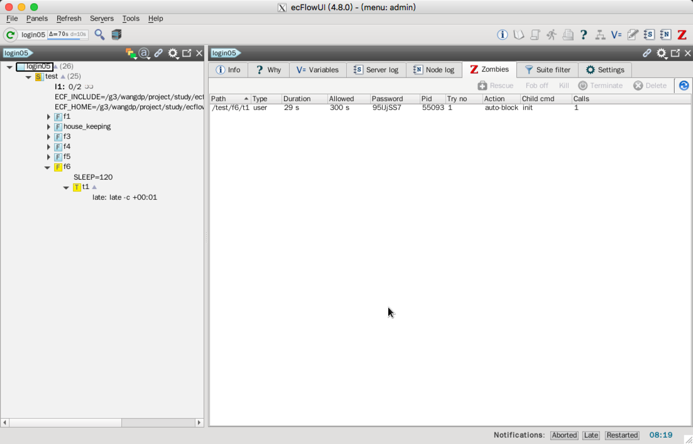

[Zombie](https://software.ecmwf.int/wiki/display/ECFLOW/Glossary#term-zombie) 是与 `ecflow_server` 通信验证权限失败的正在运行的作业。

## 如何产生

Zombie 的产生有多种原因，常见的原因集中在如下几点：

* 作业运行时，节点树被删除、替换、重新加载。
* 作业正在运行时（处于 submitted 或 active 状态），被重新运行
* 作业被强制设为新状态，如 complete

更罕见的原因有：

* ecf 脚本错误，多次运行初始化或完成命令
* ecf script 中的 child command 被放到后台，这种情况下，子节点命令执行顺序不正确。
* 负载控制器多次提交作业
* 服务器宕机，恢复 [check point](https://software.ecmwf.int/wiki/display/ECFLOW/Glossary#term-check-point) 文件过期
* 机器故障

## 如何处理

`init`，`complete`，`wait` 命令的默认行为是 `block` 作业，`event`，`label`，`meter` 的默认行为是 `fob`。

child 命令持续尝试连接 `ecflow_server`，直到24小时（由 `ecflow_client` 端的 `ECF_TIMEOUT` 指定）。之后 child 命令（`init`，`complete`，`abort`）出错退出。

根据脚本中设置，错误可能被 `trap` 获取，然后通常会调用 `abort` 子命令，这可能会再次等待 24 小时后才会退出。

因此上述方式对你的系统是否恰当很值得考虑。

可以设置子命令在服务器拒绝连接时立刻出错（通过在脚本中设置 `ECF_DENIED` 环境变量实现，请查看 `ecflow_client`），便于提早发现网络错误。

ecflow_ui 提供一个标签，列出所有的 zombies 和可以采用的处理方法。


> 选择服务节点（最顶层的节点）后，会在信息面板中出现 zombies 标签。

处理方法包括：

### Terminate

令命令失败，根据脚本可能会调用 `abort` 命令，会导致生成新的 zombie。

### Fob

允许作业继续运行。child command 命令运行结束，因此不再阻止作业。

但要特别注意可能会出现的问题。如果有两个运行中的作业，会导致数据冲突。即便有大哥作业，可以能产生问题。例如，相关命令是 event 命令，该 event 将不会被设置，如果后续的 trigger 表达式中有该 event，该 trigger 就不会生效。

### Delete

从服务器移除 zombie，作业仍被阻塞，子命令再次尝试连接 ecflow_server 时，会再次出现zombie。

手动杀掉作业时，可以使用该选项。

### Rescure

**接受** zombie，更新节点树。zobmie 的 `ECF_PASS` 将会拷贝到 task 上，因此下一次的 child command 将会正常运行。用户要确保没有其他作业运行。

### Kill

使用 `ECF_KILL_CMD` 杀掉 zombie。如果脚本中正确的信号捕获，该操作会以调用 abort 结束。

path zombies 需要手动杀掉。

> 注意：上面四中方法中，只有 Rescue 允许 child command 修改节点树的状态。

## 任务

1. 创建一个 zombie：启动某个 task，通过 ecflow_ui 立即将它设为 complete。
2. 查看 log 文件，可以看到 zombie 如何形成。

```bash
MSG:[08:16:19 2.2.2018] chd:init /test/f6/t1
LOG:[08:16:19 2.2.2018]  active: /test/f6/t1
LOG:[08:16:19 2.2.2018]  active: /test/f6
LOG:[08:16:19 2.2.2018]  active: /test
LOG:[08:16:19 2.2.2018]  active: /
...
MSG:[08:16:29 2.2.2018] --force=complete /test/f6/t1  :wangdp
LOG:[08:16:29 2.2.2018]  complete: /test/f6/t1
LOG:[08:16:29 2.2.2018]  complete: /test/f6
LOG:[08:16:29 2.2.2018]  queued: /test
LOG:[08:16:29 2.2.2018]  queued: /
...
MSG:[08:16:36 2.2.2018] --zombie_get :wangdp
MSG:[08:16:58 2.2.2018] --zombie_get :wangdp
```

3. 在 ecflow_ui 中查看 zombie 对话框（选择 host 节点，选择 zombie 标签）。



4. 试验不同的 zombie 处理方法（下面仅是展示不同的处理方法）

    - Terminate

    ```
    $ps aux | grep t1
    windroc   85467  0.0  0.0  11264  2836 pts/2    S    00:23   0:00 /bin/ksh /home/windroc/course/test/f1/t1.job4
    ```

    Terminate 日志

    ```
    MSG:[08:24:58 22.2.2016] --zombie_fail=/test/f1/t1    :windroc
    ```

    Terminate 后找不到该进程

    - Rescue

    ```
    windroc   85569  0.0  0.0   4472   920 pts/2    S    00:28   0:00 sh -c /home/windroc/course/test/f1/t1.job6 1> /home/windroc/course/test/f1/t1.6 2>&1
    windroc   85570  0.0  0.0  11264  2864 pts/2    S    00:28   0:00 /bin/ksh /home/windroc/course/test/f1/t1.job6
    windroc   85586  0.0  0.0  13688  2192 pts/2    R+   00:28   0:00 grep --color=auto t1
    ```

    日志

    ```
    MSG:[08:29:22 22.2.2016] --zombie_adopt=/test/f1/t1    :windroc
    ```
