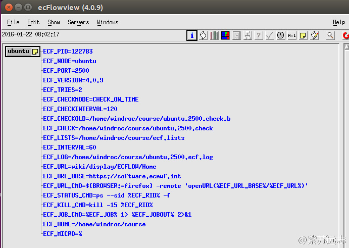

# 开始使用

本节介绍如何使用 ecFlow，并假设操作系统中已经安装过 ecFlow。

为了使用 ecFlow，需要启动 ecflow server。首先准备教程需要的目录，在 home 目录下创建 course 目录，并切换进该目录。

```text
windroc@ubuntu:~$ mkdir course
windroc@ubuntu:~$ cd course
windroc@ubuntu:~/course
```

## 共享环境

共享环境中多个用户和多个 ecFlow 服务器可以同时存在，通过使用启动脚本 ecflow_start.sh 实现。
该脚本会使用由用户ID唯一确定的端口号在你的系统中启动 ecflow_server 服务进程。
脚本默认在 $HOME/ecflow_server 目录中创建 ecFlow 的日志和 [check point](https://software.ecmwf.int/wiki/display/ECFLOW/Glossary#term-check-point) 文件。
可以使用 -d 选项改变日志和归档点文件的位置，例如将这些文件放到课程目录里：

```bash
ecflow_start.sh -d $HOME/course
```

译者注：需要修改 ecflow_start.sh 脚本，注释掉下面一行

```bash
. /home/ma/emos/bin/ecflow_site.sh || :
```

启动 ecflow 服务：

```bash
windroc@ubuntu:~/course$ ecflow_start.sh -d $HOME/course
/usr/local/bin/ecflow_start.sh: 113: /usr/local/bin/ecflow_start.sh: [[: not found
[03:11:37 21.1.2016] Request( --ping :windroc ), Failed to connect to ubuntu:2500. After 2 attempts. Is the server running ?

Thu Jan 21 03:11:37 UTC 2016

User "1000" attempting to start ecf server on "ubuntu" using ECF_PORT "2500" and with:
ECF_HOME : "/home/windroc/course"
ECF_LOG : "ubuntu.2500.ecf.log"
ECF_CHECK : "ubuntu.2500.check"
ECF_CHECKOLD : "ubuntu.2500.check.b"
ECF_OUT : "/dev/null"

client version is Ecflow version(4.0.9) boost(1.53.0) compiler(gcc 4.9.2) protocol(TEXT_ARCHIVE) Compiled on Jan 12 2016 05:57:30
Checking if the server is already running on ubuntu and port 2500
[03:11:38 21.1.2016] Request( --ping :windroc ), Failed to connect to ubuntu:2500. After 2 attempts. Is the server running ?

Backing up check point and log files

OK starting ecFlow server...

Placing server into RESTART mode...

To view server on ecflowview - goto Edit/Preferences/Servers and enter
Name :
Host : ubuntu
Port Number : 2500
```

运行之后可以查看后台进程:

```bash
windroc@ubuntu:~/course$ ps -u windroc -f | grep ecflow
windroc 122783 1842 3 19:11 pts/2 00:00:03 ecflow_server
windroc 122798 118368 0 19:13 pts/2 00:00:00 grep --color=auto ecflow
```
从 ecFlowview 中查看启动的服务器



## 本地环境

环境变量：ECF_PORT ECF_NODE ECF_HOME

推荐使用 ecflow_start.sh 脚本启动 ecFlow 服务器，来避免不需要的服务器共享使用。
可以用默认的 ECF_PORT，在 UNIX 提示符下输入下面的命令在本地机器中启动服务器

```bash
ecflow_server
```

将会在系统中以默认的名字“localhost”和默认的端口号“3141”启动ecflow_server。

```text
windroc@ubuntu:~/ecflow_temp/test1$ ecflow_server
```

## 前台运行

> 本节由译者添加

如果机器中的另一个程序占用这个端口号，就会得到一个 Address in use 错误。使用如下的命令在指定的端口号上运行服务：

```bash
ecflow_server --port=3500
```

或者

```bash
export ECF_PORT=3500; ecflow_server
```

此时如果想在 ecflowview 中查看服务，需要修改 .ecflowrc/servers 文件（默认位置），添加类似如下一行：

```text
server1 localhost 3500
```

> 如果第一个名字与 /usr/local/share/ecflow/servers 中的相同，就会被后者覆盖，所以不能命名为 localhost，因为后者文件中有 localhost 一行。

这样就能在 ecflowview 中查看新运行的服务器了。


ecflow_server 的日志文件和 check point 文件默认将在当前文件夹中创建，并且以

```text
<machine_name>.<port_number>
```

开头。这样多个服务可以运行在同一台机器上。
如果之前已经运行过一样的 ecflow_server，服务将尝试从 check point 文件中恢复 suite definition。例如

```text
windroc@ubuntu:~/ecflow_temp/test1$ ls
ubuntu.3141.ecf.check ubuntu.3141.ecf.log ubuntu.3500.ecf.log
```

运行过两个 ecflow_server，其中 3500 没有启动过，所以没有 check point 文件。

## 任务

1. 参考之前的章节安装 ecflow
2. 创建 $HOME/course 目录
3. 使用如下命令启动服务

```bash
ecflow_start.sh -d $HOME/course
```

4. 注意 ECF_NODE 和 ECF_PORT 变量
5. 注意：如果下面的章节中需要启动一个新的shell来访问服务，要确保已经设置 ECF_PORT 环境变量。
