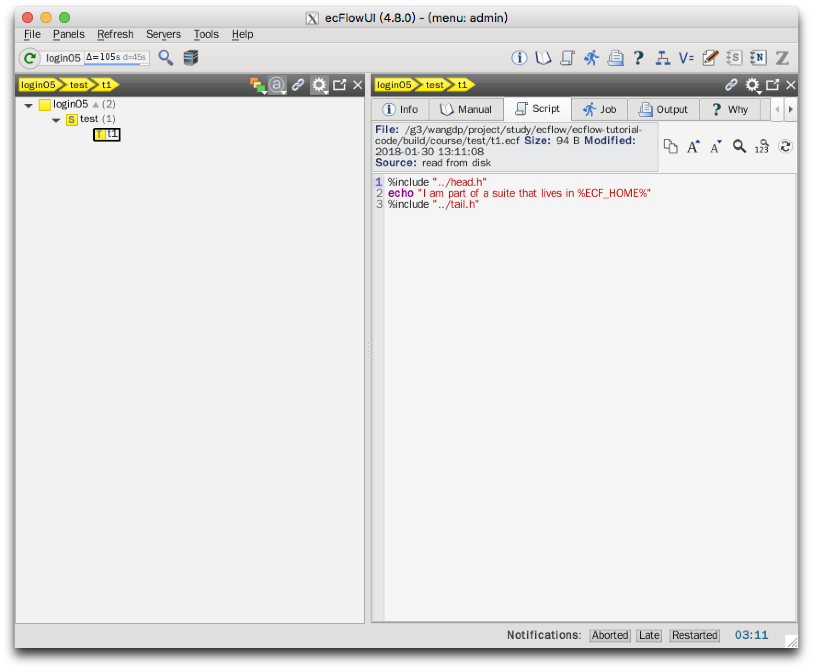
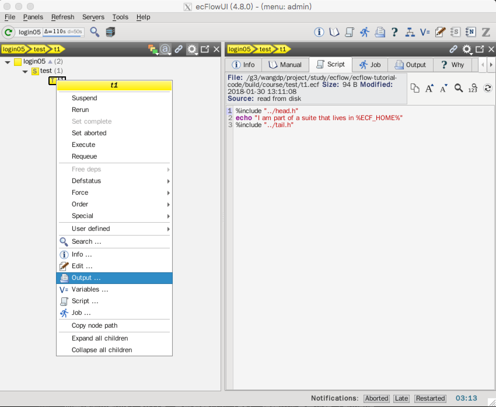

# 使用 ecflow_ui

我们看下 ecFlow 的 GUI —— ecfloe_ui：

在 UNIX 命令行输入 `ecflow_ui`。

程序运行后：

- 选择 Servers 菜单
- 点击 “Manage Servers..." 菜单
- 点击 "Add Server"，输入 ecflow 服务器的详细信息。为 ecflow 服务器取个名字，添加 Host 和 Port，点击添加按钮。

- 在 ecflow_ui 中选择 "Tools Menu: Preferences"
- 选择 Menus 并将 "menu mode" 修改为 "Administrator"

从 Servers 菜单的 All servers... 中选择要显示的服务，将在主窗体中显示服务器信息：

黄色的盒子叫做 node。黄色盒子中的字母表示 node 的种类：

- `S`: suite
- `F`: family
- `T`: task

上面右侧的子窗口是 info 面板，显示节点的信息。现在可以查看 ecf script，job file 和 task t1 的输出文件。

点击t1，在右侧窗口中选择 Script 标签：

点击不同的标签查看 ECF job 文件或者输出文件。

如果想要在不同的窗口查看输出文件，右键点击 t1 节点，在弹出菜单中选择 Output... 菜单。

如果想要重新运行 suite，鼠标右键点击 test，在弹出菜单中选择 requeue

注意 node 颜色的变化，颜色的变化反应 node 的 status。作业状态变化反映到 ecflow_ui 中可能会有很长一段时间的延时（默认为 60 秒）。可以点击 refresh 按钮或使用 F5 键立即更新当前状态。

下面我们将添加表格视图，在 View 菜单中选择 Add table view。

在树视图中选择某个节点会在表格视图中选择对应的节点。

## 任务

1. 探索 `ecflow_ui` 的菜单和窗口
2. 作业状态变化与 ecflow_ui 窗口中展现这些变化有一段较长的延时。想要更快地更新到当前状态，请点击绿色状态按钮，或者按 F5 键。
