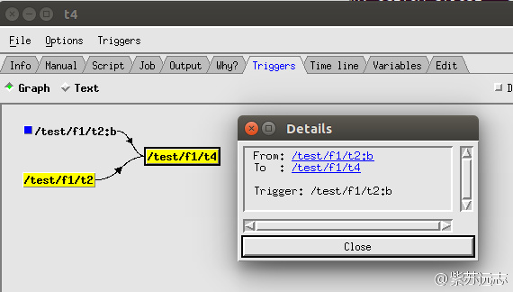

# 添加complete

有时希望在满足某条件时不运行某任务，条件可以用 event 标识。
例如， event t2:b 可能暗示 task t2 没有生成期待的结果，所以我们不需要运行 task t4.

这种情况下，可以使用 complete 表达式（[complete expression](https://software.ecmwf.int/wiki/display/ECFLOW/Glossary#term-complete-expression)），
与关键词 [trigger](https://software.ecmwf.int/wiki/display/ECFLOW/Glossary#term-trigger) 有类似的语法，
但在满足条件时将任务置为 [complete](https://software.ecmwf.int/wiki/display/ECFLOW/Glossary#term-complete) 状态而不运行该任务。

当 [ecflow_server](https://software.ecmwf.int/wiki/display/ECFLOW/Glossary#term-ecflow-server) 尝试启动一个 [task](https://software.ecmwf.int/wiki/display/ECFLOW/Glossary#term-task) 时，
会检查 trigger 和 complete 表达式。如果满足 complete 表达式，任务就会被设为 complete 状态。
检查时，complete 表达式优先于 trigger 表达式。

complete 可以用于 [task](https://software.ecmwf.int/wiki/display/ECFLOW/Glossary#term-task) 间、family 间或者两者混合，也可以与 trigger 联合使用。

## Suite Definition

在 suite definition 中定义 complete。

### Text

```bash
# Definition of the suite test.
suite test
edit ECF_INCLUDE "$HOME/course" # replace '$HOME' with the path to your home directory
edit ECF_HOME "$HOME/course"
family f1
edit SLEEP 20
task t1
task t2
trigger t1 eq complete
event a
event b
task t3
trigger t2:a
task t4
trigger t2 eq complete
complete t2:b
endfamily
endsuite
```

### Python

```python
#!/usr/bin/env python2.7
import os
import ecflow 

def create_family_f1():
    f1 = ecflow.Family("f1")
    f1.add_variable("SLEEP", 20)
    f1.add_task("t1")
    t2 = f1.add_task("t2")  
    t2.add_trigger("t1 eq complete") 
    t2.add_event("a")
    t2.add_event("b")
    f1.add_task("t3").add_trigger("t2:a")  
    t4 = f1.add_task("t4")
    t4.add_trigger("t2 eq complete")  
    t4.add_complete("t2:b")  
    return f1
      
print "Creating suite definition"   
defs = ecflow.Defs()
suite = defs.add_suite("test")
suite.add_variable("ECF_INCLUDE", os.path.join(os.getenv("HOME"),  "course"))
suite.add_variable("ECF_HOME",    os.path.join(os.getenv("HOME"),  "course"))

suite.add_family( create_family_f1() )
print defs

print "Checking job creation: .ecf -> .job0"   
print defs.check_job_creation()

print "Checking trigger expressions"
print defs.check()

print "Saving definition to file 'test.def'"
defs.save_as_defs("test.def")
```


## 任务


1. 更新 test.def 或 test.py，为 t4 添加 complete 表达式
2. 替换 [suite](https://software.ecmwf.int/wiki/display/ECFLOW/Glossary#term-suite)
3. 查看 [ecflowview](https://software.ecmwf.int/wiki/display/ECFLOW/Glossary#term-ecflowview)


4. 查看 t4 的触发器


5. 点击箭头查看触发器关系




6. 使用 Show 菜单，查看树中的触发器
7. 注意表示 task 未运行的图标
8. 可以修改 task t2，检查事件未激活时 task t4 是否运行。


