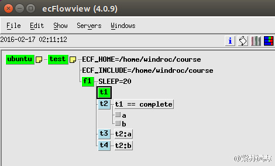

# 添加事件

有时，等待一个任务结束还不够。如果任务产生多个结果，另一个任务或许需要在第一个结果生成时就开始运行。

ecFlow 引入事件 event 概念。event 是任务运行时发送给 ecflow_server 的一个消息，每个任务可以设置多个事件。event 是 trigger 的一种。

## Ecf Script

我们将创建新的 task(t3,t4),它们被 t2 发出的事件触发。
通过拷贝 t1 创建 t3 和 t4 的 ecf script。
为了通知 ecflow_server，task（下面示例中的 t2）必须调用 ecflow_client --event。

### t2.ecf

```bash
%include <head.h>
echo "I will now sleep for %SLEEP% seconds"
sleep %SLEEP%
ecflow_client --event a       # Set the first event
sleep %SLEEP%                 # Sleep a bit more
ecflow_client --event b       # Set the second event
sleep %SLEEP%                 # A last nap...
%include <tail.h>
```

## Suite Definition

### Text

```bash
# Definition of the suite test.
suite test
   edit ECF_INCLUDE "$HOME/course"  # replace '$HOME' with the path to your home directory
   edit ECF_HOME    "$HOME/course"
   family f1
     edit SLEEP 20
     task t1
     task t2
         trigger t1 eq complete
         event a
         event b
     task t3
         trigger t2:a
     task t4
         trigger t2:b
   endfamily
endsuite
```

### Python

```python
#!/usr/bin/env python2.7
import os
import ecflow 

def create_family_f1():
    f1 = ecflow.Family("f1")
    f1.add_variable("SLEEP", 20)
    f1.add_task("t1") 
    
    t2 = f1.add_task("t2")  
    t2.add_trigger("t1 eq complete") 
    t2.add_event("a")
    t2.add_event("b")
    
    f1.add_task("t3").add_trigger("t2:a")  
    f1.add_task("t4").add_trigger("t2:b")  
    return f1

print "Creating suite definition"
defs = ecflow.Defs()
suite = defs.add_suite("test")
suite.add_variable("ECF_INCLUDE", os.path.join(os.getenv("HOME"), "course"))
suite.add_variable("ECF_HOME",    os.path.join(os.getenv("HOME"), "course"))

suite.add_family( create_family_f1() )
print defs

print "Checking job creation: .ecf -> .job0"   
print defs.check_job_creation()

print "Checking trigger expressions"
print defs.check()

print "Saving definition to file 'test.def'"
defs.save_as_defs("test.def")
```

## 任务

1. 更新 test.def 或 test.py
2. 编辑 t2.ecf，添加 ecflow_client –event 调用
3. 拷贝 t1.ecf 为 t3.ecf 和 t4.ecf
4. 替换 suite
5. 在 ecflowview 中观察任务



6. 查看 t3 的触发器


7. 查看 t2 的触发器


