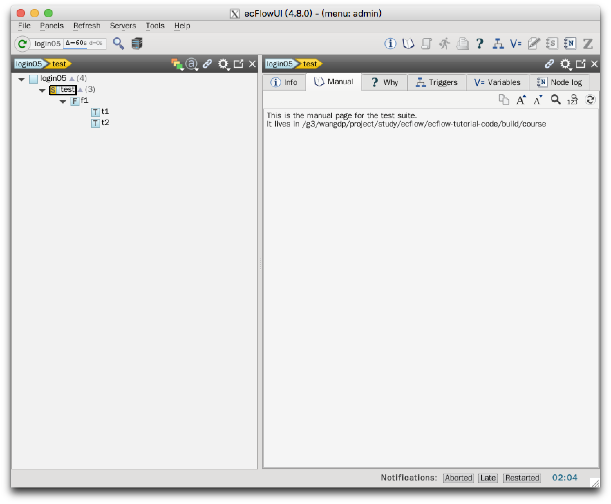

# 添加说明

[manual page](https://software.ecmwf.int/wiki/display/ECFLOW/Glossary#term-manual-page) 使 ecf script 中的文档可以在 ecflow_ui 中看到。

说明页是指令 `%manual` 和 `%end` 之前的所有文本的组合。

修改 `t2.ecf`：

```bash
%manual
   Manual for task t2
   Operations: if this task fails, set it to complete and report next working day
   Analyst:    Check something ?
%end
 
%include <head.h>
echo "I am part of a suite that lives in %ECF_HOME%"
%include <tail.h>
 
%manual
   There can be multiple manual pages in the same file.
   When viewed they are simply concatenated.
%end
```


manual 也可以添加到 family 和 suite 节点。

在 `$ECF_HOME/test` 创建 `f1.man`：

```
This manual is for family %FAMILY%
It can have any text and will also have variable substitution
Notice that this does not have manual..end since the whole file is a manual page.
```


在 `$ECF_HOME` 创建 `test.man`：

```
%manual
This is the manual page for the %SUITE% suite.
It lives in %ECF_HOME%
%end
This text is not visible in the man page since it is out side of the %manual..%end
```



注意对于 family 和 suite 节点，附加的 `%manual...%end` 不是必须的，但可以通过添加 `%manual...%end` 来决定在 GUI 中显示哪些部分的说明。

## 任务

1. 修改 `$ECF_HOME/test/f1/t2.ecf` 脚本
2. 添加 `$ECF_HOME/test/f1.man` 文件
3. 添加 ``$ECF_HOME/test.man` 文件
4. 在 ecflow_ui 中查看 task t2、family f1、suite test 的说明页
