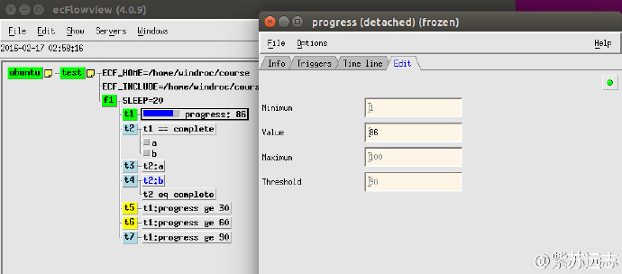

# 添加meter

[meter](https://software.ecmwf.int/wiki/display/ECFLOW/Glossary#term-meter) 类似 [event](https://software.ecmwf.int/wiki/display/ECFLOW/Glossary#term-event)，
但不同于值为 bool 类型（on/off）的 event，meter 的值可以取一个范围内的整数。
其他任务会在 meter 达到某个特定值时被处罚。类似 event，meter 有名字，一个 [task](https://software.ecmwf.int/wiki/display/ECFLOW/Glossary#term-task) 可以包含多个 meter。

## Ecf脚本

创建新的 task（t5，t6,和t7），当 task t1 的 meter 达到特定值时被触发。
为了通知 [ecflow_server](https://software.ecmwf.int/wiki/display/ECFLOW/Glossary#term-ecflow-server)，
task 必须调用 [ecflow_client](https://software.ecmwf.int/wiki/display/ECFLOW/Glossary#term-ecflow-client) --meter 命令。

### t1.ecf

```bash
%include <head.h>
echo "I will now sleep for %SLEEP% seconds"
sleep %SLEEP%
n=1
while [[ $n -le 100 ]]               # Loop 100 times
do
   sleep 1                           # Wait a short time
   ecflow_client --meter=progress $n # Notify ecFlow
   (( n = $n + 1 ))
done
%include <tail.h>
```

## Suite definition

在 suite definition 中见添加 meter。

### Text

```bash
# Definition of the suite test.
suite test
 edit ECF_INCLUDE "$HOME/course"    # replace '$HOME' with the path to your home directory
 edit ECF_HOME    "$HOME/course"
 family f1
     edit SLEEP 20
     task t1
         meter progress 1 100 90
     task t2
         trigger t1 eq complete
         event a
         event b
     task t3
         trigger t2:a
     task t4
         trigger t2 eq complete
         complete t2:b
     task t5
         trigger t1:progress ge 30
     task t6
         trigger t1:progress ge 60
     task t7
         trigger t1:progress ge 90
 endfamily
endsuite
```

### Python

```python
#!/usr/bin/env python2.7
import os
import ecflow  

def create_family_f1():
    f1 = ecflow.Family("f1") 
    f1.add_variable("SLEEP", 20)
    f1.add_task("t1").add_meter("progress", 1, 100, 90)
    
    t2 = f1.add_task("t2")  
    t2.add_trigger("t1 eq complete") 
    t2.add_event("a")
    t2.add_event("b")
    
    f1.add_task("t3").add_trigger("t2:a")  
    
    t4 = f1.add_task("t4")
    t4.add_trigger("t2 eq complete")  
    t4.add_complete("t2:b") 
     
    f1.add_task("t5").add_trigger("t1:progress ge 30")  
    f1.add_task("t6").add_trigger("t1:progress ge 60")  
    f1.add_task("t7").add_trigger("t1:progress ge 90") 
    return f1 
   
print "Creating suite definition"   
defs = ecflow.Defs()
suite = defs.add_suite("test")
suite.add_variable("ECF_INCLUDE", os.path.join(os.getenv("HOME"), "course"))
suite.add_variable("ECF_HOME",    os.path.join(os.getenv("HOME"), "course"))

suite.add_family( create_family_f1() )
print defs

print "Checking job creation: .ecf -> .job0"   
print defs.check_job_creation()

print "Checking trigger expressions"
print defs.check()

print "Saving definition to file 'test.def'"
defs.save_as_defs("test.def")
```

## 任务

1. 编辑 definition 文件或 python 脚本，添加上面的修改。
2. 编辑 t1.ecf，调用 ecflow_client --meter。
3. 拷贝 t4.ecf 为 t5.ecf t6.ecf 和 t7.ecf。
4. 替换 [suite](https://software.ecmwf.int/wiki/display/ECFLOW/Glossary#term-suite)
5. 查看 [ecflowview](https://software.ecmwf.int/wiki/display/ECFLOW/Glossary#term-ecflowview)


6. 查看 trigger


7. 在 ecflowview 的 meter progress 上右键点击，选择 Edit…



8. 修改 meter 的值，点击 Apply 图标。
