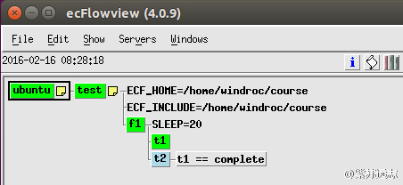
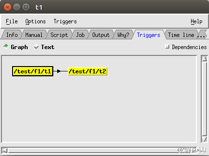
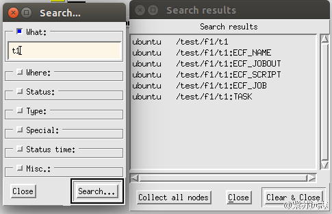

# 添加触发器

前一个练习中，我们看到两个 task 同时运行。我们想确保 t2 只在 t1 完成后再运行，因此需要定义触发器 [trigger](https://software.ecmwf.int/wiki/display/ECFLOW/Glossary#term-trigger)。

Trigger 用来声明两个任务间的依赖关系（[dependencies](https://software.ecmwf.int/wiki/display/ECFLOW/Glossary#term-dependencies)），
例如，二号任务可能需要一号任务生成的数据。
当 ecFlow 尝试启动一个任务时，它会检查 trigger 表达式。如果条件满足，任务启动，相反任务保持 [queued](https://software.ecmwf.int/wiki/display/ECFLOW/Glossary#term-queued) 状态。
Trigger 可以用在任务间、family 间或者两者的混合。

记住下面两条规则

* 所有任务都完成时，family 才完成
* 任务的 trigger 和所有父节点的 trigger 都满足时，任务才会启动。

每个节点只能有一个 trigger 表达式，但可以构建非常复杂的表达式（记住父节点的 trigger 也是隐含的 trigger）。

有时 trigger 用于防止同一时间运行过多的任务。这种情况下更好的方法就是使用 [limit](https://software.ecmwf.int/wiki/display/ECFLOW/Glossary#term-limit) （后面将会介绍 limit）。

trigger 中的表达式可以以使用节点的全名，例如

* /test/f1/t1 表示 [task](https://software.ecmwf.int/wiki/display/ECFLOW/Glossary#term-task) t1
* /test/f1 表示 [family](https://software.ecmwf.int/wiki/display/ECFLOW/Glossary#term-family) f1

```bash
trigger /test/f1/t1 == complete
```

一些情况下，ecFlow 接受相对名称，例如../t1

Trigger 可以非常复杂，ecFlow 支持所有的条件语句（not、and、or 等等），并且 trigger 可以引用节点属性，
例如 [event](https://software.ecmwf.int/wiki/display/ECFLOW/Glossary#term-event), 
[meter](https://software.ecmwf.int/wiki/display/ECFLOW/Glossary#term-meter), 
[variable](https://software.ecmwf.int/wiki/display/ECFLOW/Glossary#term-variable), 
[repeat](https://software.ecmwf.int/wiki/display/ECFLOW/Glossary#term-repeat) 和生成变量。

## Suite Definition

### Text

```bash
# Definition of the suite test.
suite test
   edit ECF_INCLUDE "$HOME/course"   # replace '$HOME' with the path to your home directory
   edit ECF_HOME    "$HOME/course"
   family f1
     edit SLEEP 20
     task t1
     task t2
         trigger t1 eq complete
   endfamily
endsuite
```

### Python

```python
#!/usr/bin/env python2.7
import os
import ecflow

def create_family_f1():
    f1 = ecflow.Family("f1" )
    f1.add_variable("SLEEP", 20)
    f1.add_task("t1")
    f1.add_task("t2").add_trigger("t1 == complete")
    return f1

print "Creating suite definition"
defs = ecflow.Defs()
suite = defs.add_suite("test")
suite.add_variable("ECF_INCLUDE", os.path.join(os.getenv("HOME"), "course"))
suite.add_variable("ECF_HOME",    os.path.join(os.getenv("HOME"), "course"))

suite.add_family( create_family_f1() )
print defs

print "Checking job creation: .ecf -> .job0"   
print defs.check_job_creation()

print "Checking trigger expressions"
print defs.check()

print "Saving definition to file 'test.def'"
defs.save_as_defs("test.def")
```



## 任务

1. 编辑 [suite definition](https://software.ecmwf.int/wiki/display/ECFLOW/Glossary#term-suite-definition)，添加 trigger
2. 替换 [suite](https://software.ecmwf.int/wiki/display/ECFLOW/Glossary#term-suite)
3. 在 [ecflowview](https://software.ecmwf.int/wiki/display/ECFLOW/Glossary#term-ecflowview) 观察任务。
4. 在ecflowview中查看 t1 和 t2 的 trigger。



5. 点击箭头，查看trigger 的关系。


6. 使用 Show 菜单设置在 ecflowview 主窗口中显示 trigger


7. 搜索t1


