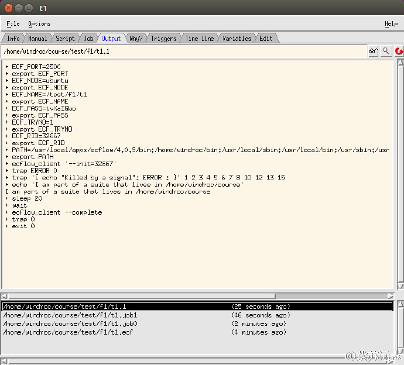

# ecFlow变量

我们已经看到 [ecFlow](https://software.ecmwf.int/wiki/display/ECFLOW/Glossary#term-ecflow) 使用一些变量
（[variable](https://software.ecmwf.int/wiki/display/ECFLOW/Glossary#term-variable)），比如 ECF_HOME。

共有三种变量：

* ecFlow 使用的变量，例如ECF_HOME
* 用户定义的变量，不应该以 ECF 开头，推荐使用大写字母来定义变量。
* ecFlow 生成的变量，可以在 job 中使用，例如包含 suite 的日期 ECF_DATE。

## Ecf脚本

之前的例子中，我们复制 t1.ecf 为 t2.ecf。编辑这两个文件，以变量 SLEEP 为参数调用 unix 的 sleep 命令。

```bash
%include <head.h>
echo "I will now sleep for %SLEEP% seconds"
sleep %SLEEP%
%include <tail.h>
```

## suite definition

添加变量到 [suite definition](https://software.ecmwf.int/wiki/display/ECFLOW/Glossary#term-suite-definition)

### Text

```bash
# Definition of the suite test.
suite test
edit ECF_INCLUDE "$HOME/course" # replace '$HOME' with the path to your home directory
edit ECF_HOME "$HOME/course"
family f1
task t1
edit SLEEP 20
task t2
edit SLEEP 20
endfamily
endsuite
```

### Python

```python
#!/usr/bin/env python2.7
import os
import ecflow

def create_family_f1():
    f1 = ecflow.Family("f1" )
    f1.add_task("t1").add_variable("SLEEP", 20)
    f1.add_task("t2").add_variable("SLEEP", 20)
    return f1

print "Creating suite definition"
defs = ecflow.Defs()
suite = defs.add_suite("test")
suite.add_variable("ECF_INCLUDE", os.path.join(os.getenv("HOME"), "course"))
suite.add_variable("ECF_HOME",    os.path.join(os.getenv("HOME"), "course"))

suite.add_family( create_family_f1() )
print defs

print "Checking job creation: .ecf -> .job0"
print defs.check_job_creation()

print "Saving definition to file 'test.def'"
defs.save_as_defs("test.def")
```

生成的 def 文件如下：

```bash
# 4.0.9
suite test
  edit ECF_HOME '/home/windroc/course'
  edit ECF_INCLUDE '/home/windroc/course'
  family f1
    task t1
      edit SLEEP '20'
    task t2
      edit SLEEP '20'
  endfamily
endsuite
```

## 任务

1. 修改文件
2. 替换 [suite](https://software.ecmwf.int/wiki/display/ECFLOW/Glossary#term-suite)
3. 查看 [ecflowview](https://software.ecmwf.int/wiki/display/ECFLOW/Glossary#term-ecflowview)，
将看到任务处于 [active](https://software.ecmwf.int/wiki/display/ECFLOW/Glossary#term-active) 状态 20 秒，查看 job output。




