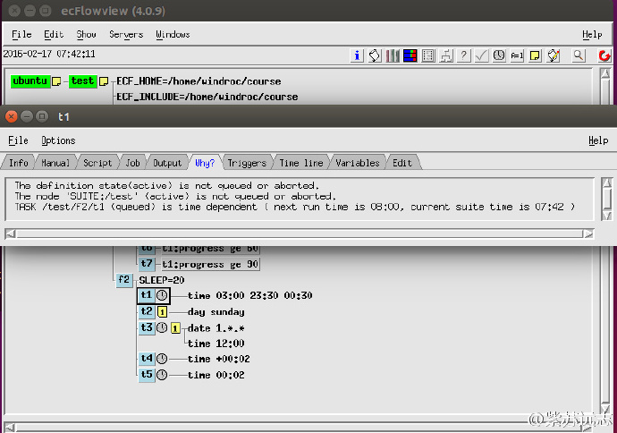

# 时间依赖

有时希望在某个特定时间点运行某个任务，或者每三个小时运行，或者每月第一天，或者星期一。

ecFlow 支持 [date](https://software.ecmwf.int/wiki/display/ECFLOW/Glossary#term-date) 和 [time](https://software.ecmwf.int/wiki/display/ECFLOW/Glossary#term-time) 依赖。

## 依赖种类

### 时间

* 绝对时间：在确定时间点运行
* 相对时间： 相对于 suite 的启动时间

时间依赖可以按常规间隔重复。一旦所有时间点都运行结束，节点变为 complete 状态

```bash
time 23:00                  # at next 23:00
time 10:00 20:00 01:00      # every hour from 10am to 8pm
time +00:01                 # one minute after the suite has begun
time +00:10 01:00 00:05     # 10 to 60 minutes after begin every 5 minutes
```

最后一个示例中，如果任务运行超过5分钟，则会错过时间点。

### 日期（date or day）

日期依赖使用 date 或 [day](https://software.ecmwf.int/wiki/display/ECFLOW/Glossary#term-day) 指定。日期依赖都是绝对的，但可以使用通配符

```bash
date 31.12.2012             # the 31st of December 2012
date 01.*.*                 # every first of the month
date *.10.*                 # every day in October
date 1.*.2008               # every first of the month, but only in 2008
day monday                  # every monday
```

### cron

Cron 依赖使用 [cron](https://software.ecmwf.int/wiki/display/ECFLOW/Glossary#term-cron) 关键字。cron 与 time 不同，设置 cron 的节点运行完成后立刻再次排队。

cron 使用 real time clock 而不是 hybrid clock

```bash
cron 23:00                  # every day at 23:00
cron 08:00 12:00 01:00      # every hour between 8 and 12
cron -w 0,2                 # every sunday and tuesday
cron -d 1,15                # every 1st and 15th of each month
cron -m 1 -d 1              # every first of January
```

## 依赖设置

每个任务可以有多个时间和日期依赖：

```bash
day sunday
day wednesday
date 01.*.*                 # The first of every month and year
date 10.*.*                 # The tenth of every month and year
time 01:00
time 16:00
```

上面的任务将在周日和周三的上午1点、下午4点运行，并且当天是每月的1号或10号。

类似 trigger，date 和 time 依赖可以设置在 family 层。这种情况下，该 family 下的 task 将根据这些依赖关系运行。

注意：所有时间相关的依赖关系（例如 cron，time，[today](https://software.ecmwf.int/wiki/display/ECFLOW/Glossary#term-today)，date 和 day）
都相对于 suite 的时钟（[clock](https://software.ecmwf.int/wiki/display/ECFLOW/Glossary#term-clock)）。更多信息请查看《Dates and Clocks》。

#### 文本方式

让我们修改 definition 文件，添加一个 family f2。为了简便，下面的代码中省略前面的 family f1。

```bash
# Definition of the suite test
suite test
 edit ECF_INCLUDE "$HOME/course"  # replace '$HOME' with the path to your home directory
 edit ECF_HOME    "$HOME/course"
 
 family f2
     edit SLEEP 20
     task t1
         time 00:30 23:30 00:30
     task t2
         day sunday
     task t3
         date 01.*.*
         time 12:00
     task t4
         time +00:02
     task t5
         time 00:02
 endfamily
endsuite
```

#### Python

省略 family f1 部分代码。

```python
#!/usr/bin/env python2.7
import os
import ecflow  

def create_family_f2():
    f2 = ecflow.Family("f2")
    f2.add_variable("SLEEP", 20)
    f2.add_task("t1").add_time( "00:30 23:30 00:30" ) # start(hh:mm) end(hh:mm) increment(hh:mm)
    f2.add_task("t2").add_day( "sunday" )
   
    # for add_date(): day,month,year; here 0 means every month, and every year
    t3 = f2.add_task("t3")
    t3.add_date(1, 0, 0)           # day month year, first of every month or every year
    t3.add_time( 12, 0 )           # hour, minutes at 12 o'clock
   
    f2.add_task("t4").add_time( 0, 2, True ) # hour, minutes, relative to suite start
                                             # 2 minutes after family f2 start
    f2.add_task("t5").add_time( 0, 2 )       # hour, minutes suite site
                                             # 2 minutes past midnight
    return f2
            
print "Creating suite definition"   
defs = ecflow.Defs()
suite = defs.add_suite("test")
suite.add_variable("ECF_INCLUDE", os.path.join(os.getenv("HOME"),  "course"))
suite.add_variable("ECF_HOME",    os.path.join(os.getenv("HOME"),  "course"))

suite.add_family( create_family_f1() )
suite.add_family( create_family_f2() )
print defs

print "Checking job creation: .ecf -> .job0"   
print defs.check_job_creation()

print "Checking trigger expressions"
print defs.check()

print "Saving definition to file 'test.def'"
defs.save_as_defs("test.def")
```

生成的 def 文件

```bash
# 4.0.9
suite test
  edit ECF_HOME '/home/windroc/course'
  edit ECF_INCLUDE '/home/windroc/course'
  family f1
    edit SLEEP '20'
    task t1
      meter progress 1 100 90
    task t2
      trigger t1 == complete
      event a
      event b
    task t3
      trigger t2:a
    task t4
      complete t2:b
      trigger t2 eq complete
    task t5
      trigger t1:progress ge 30
    task t6
      trigger t1:progress ge 60
    task t7
      trigger t1:progress ge 90
  endfamily
  family f2
    edit SLEEP '20'
    task t1
      time 03:00 23:30 00:30
    task t2
      day sunday
    task t3
      time 12:00
      date 1.*.*
    task t4
      time +00:02
    task t5
      time 00:02
  endfamily
endsuite
```

## 任务

1. 修改 suite definition 文件

2. 拷贝 /test/f1/t7 创建所有需要的 ecf script

3. 加载并启动 suite


4. ecflowview 有个独立的窗口解释为啥某个任务处于 [queued](https://software.ecmwf.int/wiki/display/ECFLOW/Glossary#term-queued) 状态。选择一个 queued 任务，点击问号按钮


