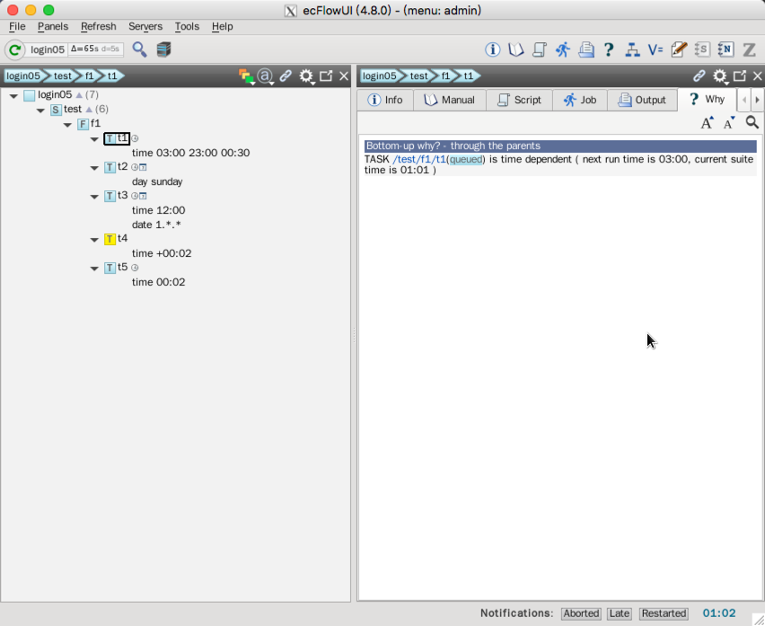

# 时间依赖

有时希望在某个特定时间点运行某个任务，或者每三个小时运行，或者每月第一天，或者星期一。

ecFlow 支持 [date](https://software.ecmwf.int/wiki/display/ECFLOW/Glossary#term-date) 和 [time](https://software.ecmwf.int/wiki/display/ECFLOW/Glossary#term-time) 依赖。

## 依赖种类

### 时间

* 绝对时间：在确定时间点运行
* 相对时间：相对于 suite 的启动时间

时间依赖可以按规则间隔重复。一旦所有时间点都运行结束，节点变为 complete 状态。

```bash
time 23:00                  # at next 23:00
time 10:00 20:00 01:00      # every hour from 10am to 8pm
time +00:01                 # one minute after the suite has begun
time +00:10 01:00 00:05     # 10 to 60 minutes after begin every 5 minutes
```

最后一个示例中，如果任务运行超过5分钟，则会错过时间点。

### 日期（date or day）

日期依赖使用 date 或 [day](https://software.ecmwf.int/wiki/display/ECFLOW/Glossary#term-day) 指定。
日期依赖都是绝对的，但可以使用通配符。

```bash
date 31.12.2012             # the 31st of December 2012
date 01.*.*                 # every first of the month
date *.10.*                 # every day in October
date 1.*.2008               # every first of the month, but only in 2008
day monday                  # every monday
```

### cron

Cron 依赖使用 [cron](https://software.ecmwf.int/wiki/display/ECFLOW/Glossary#term-cron) 关键字。`cron` 与 `time` 不同，设置 `cron` 的节点运行完成后立刻再次排队。

cron 使用 **real time clock** 而不是 **hybrid clock**

```bash
cron 23:00                 # every day at 23:00
cron 08:00 12:00 01:00     # every hour between 8 and 12
cron -w 0,2    11:00       # every sunday and tuesday at 11 am
cron -d 1,15   02:00       # every 1st and 15th of each month at 2 am
cron -m 1 -d 1 14:00       # every first of January at 2 pm
```

> Time, Today, Cron<br/>
  当 time 过期后，对应的节点可以随意运行，time 仍然保持过期，直到节点被重新排队。

## 依赖设置

每个任务可以有多个时间和日期依赖：

```bash
task tt
   day monday   # Here Day/date acts like a guard over the time. i.e time is not considered until Monday
   time 10:00   # run on Monday at 10 am
```

```bash
task tt
   day sunday                  # On the same node, Day/date act like a guard over the time attributes.
   day wednesday
   date 01.*.*                 # The first of every month and year
   date 10.*.*                 # The tenth of every month and year
   time 01:00                  # The time is only set free *if* we are on one of the day/dates
   time 16:00
```

上面的任务将在周日和周三的上午1点、下午4点运行，并且当天是每月的1号或10号。

> 同一个节点设置多个时间依赖时，相同类型的依赖是**或**关系，不同类型的依赖是**和**关系。

类似 trigger，date 和 time 依赖可以设置在 family 层。这种情况下，该 family 下的 task 将根据这些依赖关系运行。

> 注意：所有时间相关的依赖关系（例如 cron，time，[today](https://software.ecmwf.int/wiki/display/ECFLOW/Glossary#term-today)，date 和 day）
都相对于 suite 的时钟（[clock](https://software.ecmwf.int/wiki/display/ECFLOW/Glossary#term-clock)）。更多信息请查看《Dates and Clocks》。

### 文本方式

让我们修改 definition 文件，添加一个 family f2。为了简便，下面的代码中省略前面的 family f1。

```bash
# Definition of the suite test
suite test
 edit ECF_INCLUDE "$ECF_HOME"  # replace '$ECF_HOME' with the path to your ECF_HOME directory
 edit ECF_HOME    "$ECF_HOME"
 
 family f2
     edit SLEEP 20
     task t1
         time 00:30 23:30 00:30
     task t2
         day sunday
     task t3
         date 01.*.*
         time 12:00
     task t4
         time +00:02
     task t5
         time 00:02
 endfamily
endsuite
```

### Python

省略 family f1 部分代码。

```python
import os
from pathlib import Path
from ecflow import Defs, Suite, Task, Family, Edit, Trigger, Event, Complete, Meter, Time, Day, Date


def create_family_f2():
    return Family(
        "f1",
        Edit(SLEEP=20),
        Task("t1",
             Time("03:00 23:00 00:30")),
        Task("t2",
             Day("sunday")),
        Task("t3",
             Date("1.*.*"),
             Time("12:00")
             ),
        Task("t4",
             Time("+00:02")),
        Task("t5",
             Time("00:02"))
    )


print("Creating suite definition")
home = os.path.abspath(Path(Path(__file__).parent, "../../../build/course"))
defs = Defs(
    Suite('test',
          Edit(ECF_INCLUDE=home, ECF_HOME=home),
          create_family_f2()))
print(defs)

print("Checking job creation: .ecf -> .job0")
print(defs.check_job_creation())

print("Saving definition to file 'test.def'")
defs.save_as_defs(str(Path(home, "test.def")))

# To restore the definition from file 'test.def' we can use:
# restored_defs = ecflow.Defs("test.def")
```

运行脚本：

```
$python test.py
Creating suite definition
# 4.8.0
suite test
  edit ECF_INCLUDE '/g3/wangdp/project/study/ecflow/ecflow-tutorial-code/build/course'
  edit ECF_HOME '/g3/wangdp/project/study/ecflow/ecflow-tutorial-code/build/course'
  family f2
    edit SLEEP '20'
    task t1
      time 03:00 23:00 00:30
    task t2
      day sunday
    task t3
      time 12:00
      date 1.*.*
    task t4
      time +00:02
    task t5
      time 00:02
  endfamily
endsuite

Checking job creation: .ecf -> .job0

Saving definition to file 'test.def'
```

## 任务

1. 修改 suite definition 文件

2. 拷贝 `/test/f1/t7` 创建所有需要的 ecf script

3. 加载并启动 suite

    

4. ecflow_ui 有个独立的窗口解释为啥某个任务处于 [queued](https://software.ecmwf.int/wiki/display/ECFLOW/Glossary#term-queued) 状态。选择一个 queued 任务，点击问号按钮

    
