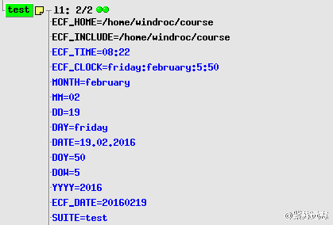

# 日期和时钟

因为 ecFlow 是为 ECMWF 系统设计的，所以日期是一个重要的概念。

使用 [clock](https://software.ecmwf.int/wiki/display/ECFLOW/Glossary#term-clock) 定义 suite 的日期，
clock 是 suite 的树形，不同的 suite 可以有不同的时钟。

两种类型

* [real clock](https://software.ecmwf.int/wiki/display/ECFLOW/Glossary#term-real-clock)：真实的机器时间，日期在零点或增加一天
* [hybrid clock](https://software.ecmwf.int/wiki/display/ECFLOW/Glossary#term-hybrid-clock)：日期和时间不相关，在 suite 完成前，日期固定，主要适用于超过24小时的 suite。时间与机器时间相同

suite 的 clock 可以修改。这对那些运行在过去日期的 suite 十分有用（例如清除旧数据）

ECF_DATE：生成变量，日期

ECF_TIME：生成变量，时间

ECF_CLOCK：生成变量，更详细的信息，例如星期



job 中使用 suite 生成的日期和时间变量更安全，不推荐直接访问系统时间。

## 作业

1. 尝试修改 suite，使用 ecflow_client --alter 用上一周的某个 clock 日期运行 suite。

```bash
windroc@ubuntu:~/course$ ecflow_client --alter change clock_date 10.02.2016 /test
```

2. 查看 ecFlow 的变量。


注意：

* 如果使用 repeat date 类型结构，date、day和 clock 属性当前不可用。
* 带单个时间依赖的 cron 会自动重新提交。
* 修改时钟后，需要重新排队整个 suite。