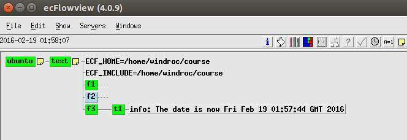

# Label

有时需要使用 ecflowview 查看任务的特殊信息，这就需要用到 [label](https://software.ecmwf.int/wiki/display/ECFLOW/Glossary#term-label)。
label 是与 task 关联的字符串，可以使用 ecflow_client --label 命令更新。

## Ecf脚本

创建新的 family f3 和它的一个 task t1。

创建相应的 ecf script，位于 $HOME/course/test/f3/t1.ecf

```bash
%include <head.h>
n=1
while [[ $n -le 5 ]]                  # Loop 5 times
do
   msg="The date is now $(date)"
   ecflow_client --label=info "$msg"  # Set the label
   sleep 60                           # Wait a one minute
   (( n = $n + 1 ))
done
 
ecflow_client --label info "I have now finished my work."
 
%include <tail.h>
```

## suite definition

下面的代码中省略之前的 family f1 和 family f2。

### 文本方式

```bash
# Definition of the suite test. Note Family f1,f2 from previous pages are omitted
suite test
 edit ECF_INCLUDE "$HOME/course"
 edit ECF_HOME    "$HOME/course"
 family f3
     task t1
         label info ""
 endfamily
endsuite
```

### Python

```python
#!/usr/bin/env python2.7
import os
import ecflow 
 
print "Creating suite definition"   
defs = ecflow.Defs()
suite = defs.add_suite("test")
suite.add_variable("ECF_INCLUDE", os.getenv("HOME") + "/course")
suite.add_variable("ECF_HOME",    os.getenv("HOME") + "/course")

suite.add_family("f3").add_task("t1").add_label("info","") 
print defs

print "Checking job creation: .ecf -> .job0"   
print defs.check_job_creation()

print "Saving definition to file 'test.def'"
defs.save_as_defs("test.def")
```

## 任务

1. 修改 suite definition 文件或者 python 脚本

2. 创建新的 ecf script 文件 $HOME/course/test/f3/t1.ecf

3. 替换 suite definition

4. 观察 ecflowview


