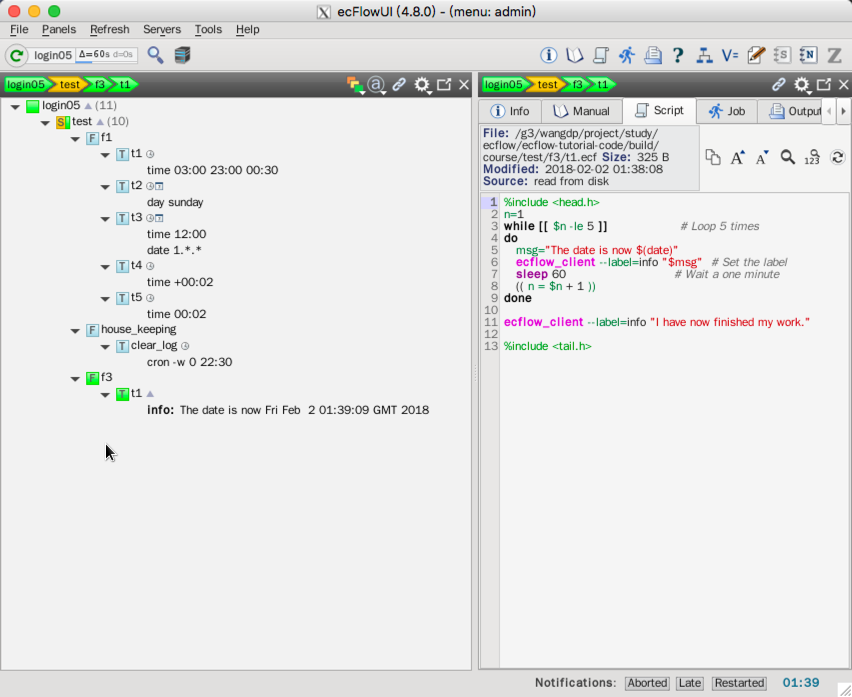

# Label

有时需要使用 ecflow_ui 查看任务的特殊信息，这就需要用到 [label](https://software.ecmwf.int/wiki/display/ECFLOW/Glossary#term-label)。
label 是与 task 关联的字符串，可以使用 `ecflow_client --label` 命令更新。

## Ecf脚本

创建新的 family f3 和它的一个 task t1。

创建相应的 ecf script，位于 `$ECF_HOME/test/f3/t1.ecf`

```bash
%include <head.h>
n=1
while [[ $n -le 5 ]]                  # Loop 5 times
do
   msg="The date is now $(date)"
   ecflow_client --label=info "$msg"  # Set the label
   sleep 60                           # Wait a one minute
   (( n = $n + 1 ))
done
 
ecflow_client --label=info "I have now finished my work."
 
%include <tail.h>
```

## suite definition

下面的代码中省略之前的 family f1 和 family f2。

### 文本方式

```bash
# Definition of the suite test. Note Family f1,f2 from previous pages are omitted
suite test
 edit ECF_INCLUDE "$ECF_HOME"
 edit ECF_HOME    "$ECF_HOME"
 family f3
     task t1
         label info ""
 endfamily
endsuite
```

### Python

```python
import os
from pathlib import Path
from ecflow import Defs, Suite, Task, Family, Edit, Trigger, \
    Event, Complete, Meter, Time, Day, Date, Cron, Label


# ... skip ...

def create_family_f3():
    return Family("f3",
                  Task("t1",
                       Label("info", "")))


print("Creating suite definition")
home = os.path.abspath(Path(Path(__file__).parent, "../../../build/course"))
defs = Defs(
    Suite('test',
          Edit(ECF_INCLUDE=home, ECF_HOME=home),
          create_family_f1(),
          create_family_house_keeping(),
          create_family_f3()))
print(defs)

print("Checking job creation: .ecf -> .job0")
print(defs.check_job_creation())

print("Saving definition to file 'test.def'")
defs.save_as_defs(str(Path(home, "test.def")))

# To restore the definition from file 'test.def' we can use:
# restored_defs = ecflow.Defs("test.def")
```

运行脚本：

```
$python test.py
Creating suite definition
# 4.8.0
suite test
  edit ECF_INCLUDE '/g3/wangdp/project/study/ecflow/ecflow-tutorial-code/build/course'
  edit ECF_HOME '/g3/wangdp/project/study/ecflow/ecflow-tutorial-code/build/course'
  # ... skip ...
  family f3
    task t1
      label info ""
  endfamily
endsuite

Checking job creation: .ecf -> .job0

Saving definition to file 'test.def'
```


## 任务

1. 修改 suite definition 文件或者 python 脚本
2. 创建新的 ecf script 文件 `$ECF_HOME/test/f3/t1.ecf`
3. 替换 suite definition
4. 观察 ecflow_ui

    
