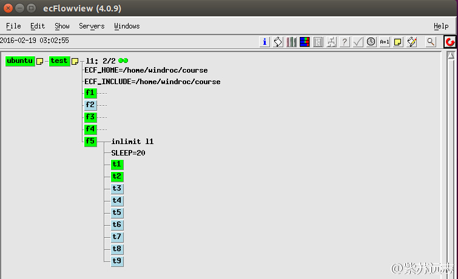
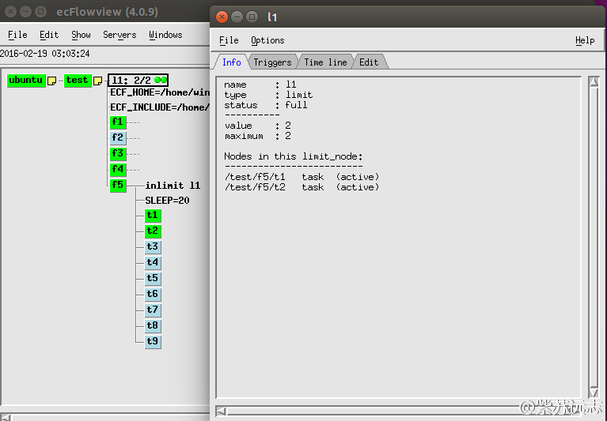
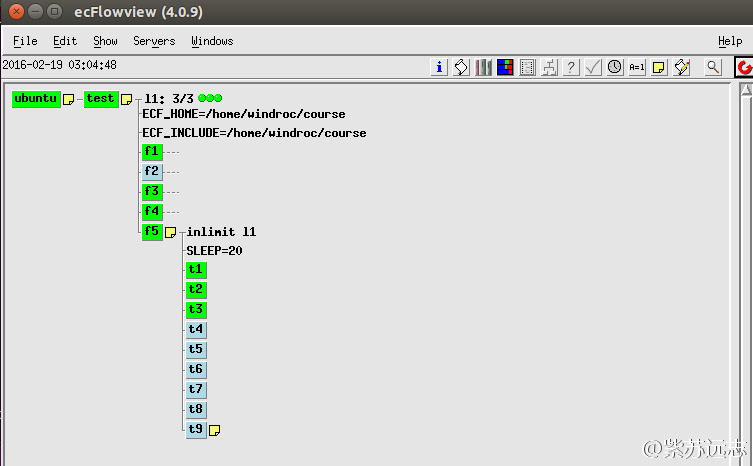
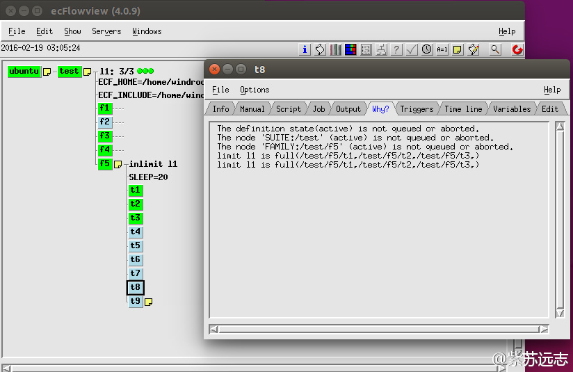

# Limit

limits 提供简单的负载管理，限制提交到某个 ecflow_server 上的作业数目。

suite 设计者使用两种触发器：

* data dependency trigger：由 trigger 关键词设置
* courtesy trigger：由 [limit](https://software.ecmwf.int/wiki/display/ECFLOW/Glossary#term-limit) 关键词设置

trigger 是第一种触发器。第二种用于防止同时运行过多的作业，实际上是一种人工的作业排队方法。
因为 ecflow 不区分这两种触发器，不利于后续维护。所以引入 limit。

## inlimit

limits 与 [inlimit](https://software.ecmwf.int/wiki/display/ECFLOW/Glossary#term-inlimit) 同时使用。

首先定义limit： limit NAME N，通常放在 suite 级

接着将 定义一组想应用该 limit 的 task，将 inlimit NAME 属性添加到节点。添加到 task 中将该 task 加入到 limit 组；添加到 family 将该 family 下的所有任务添加到 limit 组。

limit 的效果是确保该组中同时运行的任务数不超过 N。一个节点可以被多个 limit 限制。

## Ecf脚本

创建有九个 task 的 family f5。

在 $HOME/course/test/f5/ 目录下创建这些 ecf script 脚本，每个内容如下：

```bash
%include <head.h>
echo "I will now sleep for %SLEEP% seconds"
sleep %SLEEP%
%include <tail.h>
```

## suite definition

在 suite definition 中添加 limit。

### Text

```bash
# Definition of the suite test.
suite test
 edit ECF_INCLUDE "$HOME/course"
 edit ECF_HOME    "$HOME/course"
 limit l1 2
 
 family f5
     inlimit l1
     edit SLEEP 20
     task t1
     task t2
     task t3
     task t4
     task t5
     task t6
     task t7
     task t8
     task t9
 endfamily
endsuite
```

#### 定义语法

```bash
limit  ::=  "limit" >> ( identifier >> unsigned int ) >> +nextline
inlimit  ::=  "inlimit" >>( (nodePath >> ":“ >> identifier) | identifier )) >> ! unsigned int >> +nextline
```

### Python

```python
#!/usr/bin/env python2.7
import os
import ecflow  
 
def create_family_f5() :
    f5 = ecflow.Family("f5")
    f5.add_inlimit("l1")
    f5.add_variable("SLEEP", 20)
    for i in range(1, 10):
        f5.add_task( "t" + str(i) )
    return f5
    
print "Creating suite definition"   
defs = ecflow.Defs()
suite = defs.add_suite("test")
suite.add_variable("ECF_INCLUDE", os.path.join(os.getenv("HOME"),  "course"))
suite.add_variable("ECF_HOME",    os.path.join(os.getenv("HOME"),  "course"))

suite.add_limit("l1", 2)
suite.add_family( create_family_f5() )
print defs

print "Checking job creation: .ecf -> .job0"   
print defs.check_job_creation()
```

## Python API

### ecflow.InLimit

创建

```bash
InLimit(name, optional, optional)
   string name           : The name of the referenced Limit
   string path : The path to the Limit, if this is left out, then Limit of 'name' must be specified
                           some where up the parent hierarchy
   int value   : The usage of the Limit. Each job submission will consume 'value' tokens
                           from the Limit. defaults to 1 if no value specified.
```

使用

```python
inlimit = InLimit("fast","/x/f", 2)
# ...
family.add_inlimit(inlimit)
```

### ecflow.Limit

创建

```bash
Limit(name,value)
   string name: the name of the limit
   int   value: The value of the limit
```

```python
limit = Limit("fast", 10)
# ...
suite.add_limit(limit)
```

## 任务

1. 修改
2. 替换 suite definition



3. 在 ecflowview 中观察 limit l1
4. 打开 l1 的 info 面板



5. 修改 limit 的值



6. 打开 /test/f5 下某个排队 task 的 Why 面板


