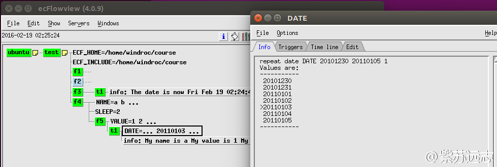
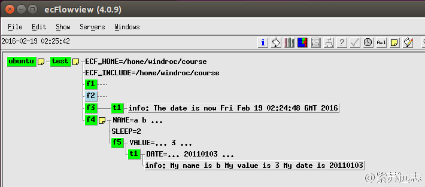

# Repeat

有时需要重复多次运行某些 task 或 family，按某指定值循环。
ecFlow 提供 [repeat](https://software.ecmwf.int/wiki/display/ECFLOW/Glossary#term-repeat) 属性实现该功能。

repeat 可以按下列类型的序列循环：

* 字符串
* 整数
* 日期

整数和日期的序列由起始元素、终止元素和可选的间隔（默认为1）生成。
ecFlow 会创建一个与 repeat 名字对应的变量，可以在脚本或 trigger 表达式中使用。

## Ecf脚本

```bash
%include <head.h>
ecflow_client --label=info "My name is %NAME%" "My value is %VALUE%" "My date is %DATE%"
sleep %SLEEP%
%include <tail.h>
```

## Suite definition

在 suite definition 中添加 repeat

### Text

定义语法：

```bash
repeat  ::=  "repeat" >> repeat_type >> +nextline
repeat_type  ::=  repeat_date | repeat_day | repeat_month | repeat_year | repeat_integer | repeat_enumerated | repeat_string
repeat_day  ::=  "day" >> unsigned integer >> !ymd
repeat_month  ::=  "month" >> unsigned integer >> !ymd
repeat_year  ::=  "year" >> unsigned integer >> !ymd
repeat_integer  ::=  "integer" >> identifier >> integer >> " " >> integer >> " " >> integer
repeat_enumerated  ::=  "enumerated" >> identifier >> +identifier
repeat_string  ::=  "string" >> identifier >> +identifier
repeat_date  ::=  "date" >> identifier >> ymd >> ymd >> integer
```

下面以整型和日期为例说明。

```bash
# Definition of the suite test.
suite test
 edit ECF_INCLUDE "$HOME/course"
 edit ECF_HOME    "$HOME/course"
 
 family f4
     edit SLEEP 2
     repeat string NAME a b c d e f
     family f5
         repeat integer VALUE 1 10
         task t1
             repeat date DATE 19991230 20000105
             label info ""
     endfamily
 endfamily
endsuite
```

### Python

```python
#!/usr/bin/env python2.7
import os
import ecflow  
    
def create_family_f4():
    f4 = ecflow.Family("f4")
    f4.add_variable("SLEEP", 2)
    f4.add_repeat( ecflow.RepeatString("NAME", ["a", "b", "c", "d", "e", "f" ] ) )
   
    f5 = f4.add_family("f5")
    f5.add_repeat( ecflow.RepeatInteger("VALUE", 1, 10) )
   
    t1 = f5.add_task("t1")
    t1.add_repeat( ecflow.RepeatDate("DATE", 20101230, 20110105) )
    t1.add_label("info", "")
    return f4
    
print "Creating suite definition"   
defs = ecflow.Defs()
suite = defs.add_suite("test")
suite.add_variable("ECF_INCLUDE", os.path.join(os.getenv("HOME"),  "course"))
suite.add_variable("ECF_HOME",    os.path.join(os.getenv("HOME"),  "course"))

suite.add_family( create_family_f4() )
print defs

print "Checking job creation: .ecf -> .job0"   
print defs.check_job_creation()

print "Saving definition to file 'test.def'"
defs.save_as_defs("test.def")
```

注意下面的对应关系

文本：ecflow.RepeatString

整数：ecflow.RepeatInteger

日期：ecflow.RepeatDate

#### Python API 说明

##### ecflow.RepeatDate 日期

```bash
RepeatDate(variable,start,end,delta)
   string variable:     The name of the repeat. The current date can referenced in
                        in trigger expressions using the variable name
   int start:           Start date, must have format: yyyymmdd
   int end:             End date, must have format: yyyymmdd
   int delta: default = 1, Always in days. The increment used to update the date
```

示例

```python
rep = RepeatDate("YMD", 20050130, 20050203 )
rep = RepeatDate("YMD", 20050130, 20050203, 2 )
```

##### ecflow.RepeatDay 天

```bash
RepeatDay(step)
   int step:     The step.
```

示例：

```python
rep = RepeatDay( 1 )
```

##### ecflow.RepeatEnumerated 数组

```bash
RepeatEnumerated(variable,list)
   string variable:     The name of the repeat. The current enumeration index can be
                        referenced in trigger expressions using the variable name
   vector list:         The list of enumerations
```

示例：

```python
rep = RepeatEnumerated("COLOR", [ 'red', 'green', 'blue' ] )
```

##### ecflow.RepeatInteger 整数

```bash
RepeatInteger(variable,start,end,step)
   string variable:     The name of the repeat. The current integer value can be
                        referenced in trigger expressions using the variable name
   int start:           Start integer value
   int end:             End end integer value
   int step:  Default = 1, The step amount
```

示例

```python
rep = RepeatInteger("HOUR", 6, 24, 6 )
```

##### ecflow.RepeatString 字符串

```bash
RepeatString(variable,list)
   string variable:     The name of the repeat. The current index of the string list can be
                        referenced in trigger expressions using the variable name
   vector list:         The list of enumerations
```

示例：

```python
rep = RepeatString("COLOR", [ 'red', 'green', 'blue' ] )
```

## 任务

1. 完成修改
2. 替换 suite definition


3. 在 ecflowview 中查看 repeat 变量



4. /test/f4/f5/t1 将会运行多少次？
5. 尝试在 ecflowview 中修改某个 repeat 的值。



